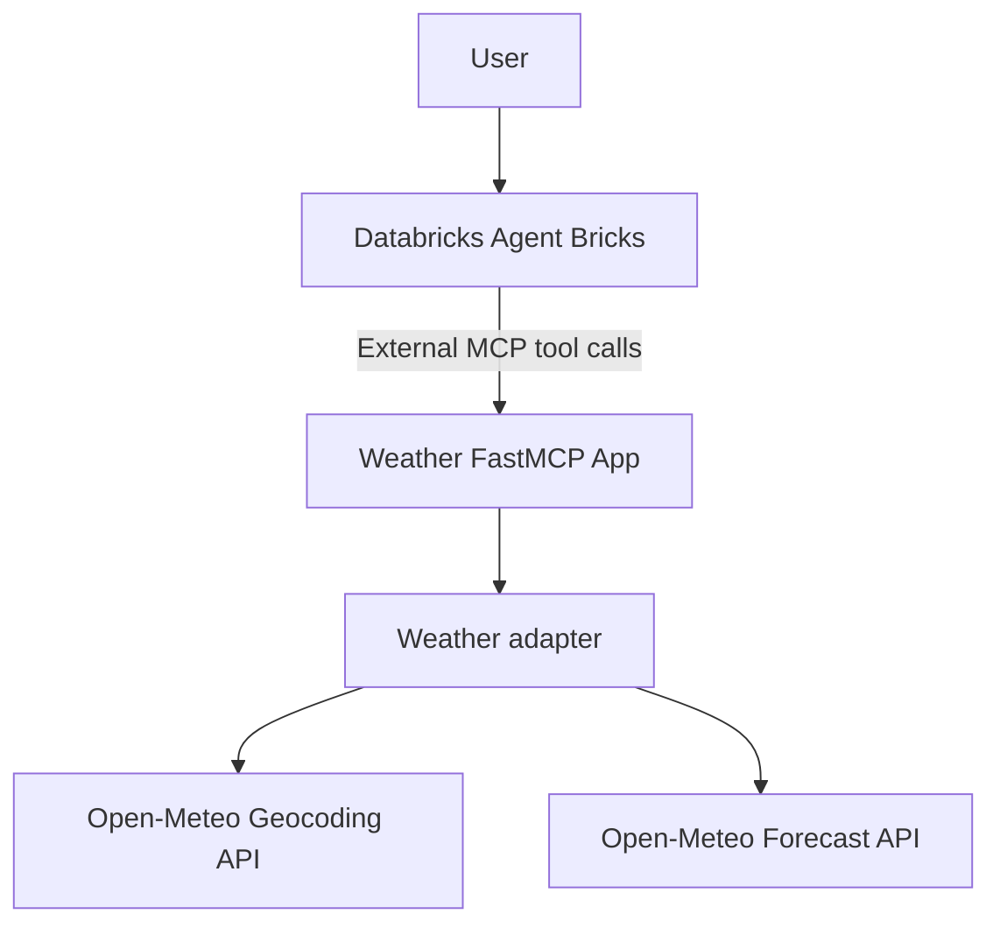

# Weather Prediction MCP Server + Databricks Agent

An educational weather assistant built for the Databricks AI Bootcamp. It exposes live Open-Meteo data through a FastMCP server and is designed to be registered as an external MCP tool in Databricks Agent Bricks.

## Architecture



The MCP tool functions contain no raw HTTP logic. `weather_adapter.py` resolves locations, calls Open-Meteo, validates responses, and returns normalized dictionaries.

## Weather tools

| Tool | Purpose |
|---|---|
| `get_current_weather(location)` | Temperature, apparent temperature, humidity, precipitation, wind, and conditions. |
| `get_forecast(location, days)` | A 1–16 day forecast with highs/lows, rain probability, rain amount, wind, UV, and conditions. |
| `get_weather_recommendation(location, date)` | Derived umbrella, jacket, sun, and wind advice for an ISO date. |

The recommendation logic is deterministic:

- umbrella/waterproof layer when precipitation probability is at least 40%;
- jacket when minimum temperature is below 12 C;
- sun protection when UV index is at least 6;
- wind caution when maximum wind is at least 40 km/h.

## API and security

This project uses the Open-Meteo Geocoding and Forecast APIs. They require no API key for non-commercial use, so there is no weather credential to store or commit. `.env` is ignored. No secrets are hardcoded.

## Project structure

```text
mcp_server/
  app.yaml
  requirements.txt
  weather_adapter.py
  weather_mcp_server.py
agent/
  system_prompt.md
  demonstration.md
tests/
docs/screenshots/
README.md
```

## Local setup and tests

```bash
python -m venv .venv
source .venv/bin/activate
pip install -r mcp_server/requirements.txt pytest
pytest -q
python mcp_server/weather_mcp_server.py
```

The streamable HTTP MCP endpoint is available at `http://localhost:8000/mcp` by default.

## Deploy the MCP server as a Databricks App

1. Create or update a Databricks Git Folder from this GitHub repository.
2. Create a Databricks App using the `mcp_server` directory as the app source.
3. Deploy the app. `app.yaml` starts `weather_mcp_server.py`, which listens on `DATABRICKS_APP_PORT` and uses streamable HTTP.
4. Open the app logs and verify that startup completes without an exception.
5. Copy the deployed app URL. The MCP endpoint is `<APP_URL>/mcp`.

## Register with Agent Bricks

1. In Databricks, open **Agents** and create a new agent.
2. Add an **External MCP** tool using `<APP_URL>/mcp`.
3. Copy the complete prompt from [`agent/system_prompt.md`](agent/system_prompt.md) into the agent system instructions.
4. Confirm that all three tools appear: `get_current_weather`, `get_forecast`, and `get_weather_recommendation`.
5. Run the prompts in [`agent/demonstration.md`](agent/demonstration.md) and capture each visible tool call plus final answer.

## Error behavior

- Unknown or ambiguous locations return a clean error and ask for a more specific place.
- Forecast length outside 1–16 days is rejected before an API call.
- Recommendation dates must use `YYYY-MM-DD` and fall between today and 15 days ahead.
- API timeouts and invalid responses are converted to a user-safe service error.
- The agent prompt explicitly forbids guessing when a tool fails.

## Submission evidence

Before submitting, add screenshots under `docs/screenshots/` for three distinct weather questions, showing both the MCP tool call and final answer. Include the Databricks App URL in the submission form or provide a deployment screenshot if workspace access cannot be shared.

## Disclaimer

Forecasts can change. This educational assistant is not an emergency warning system; consult official local alerts for dangerous weather.
