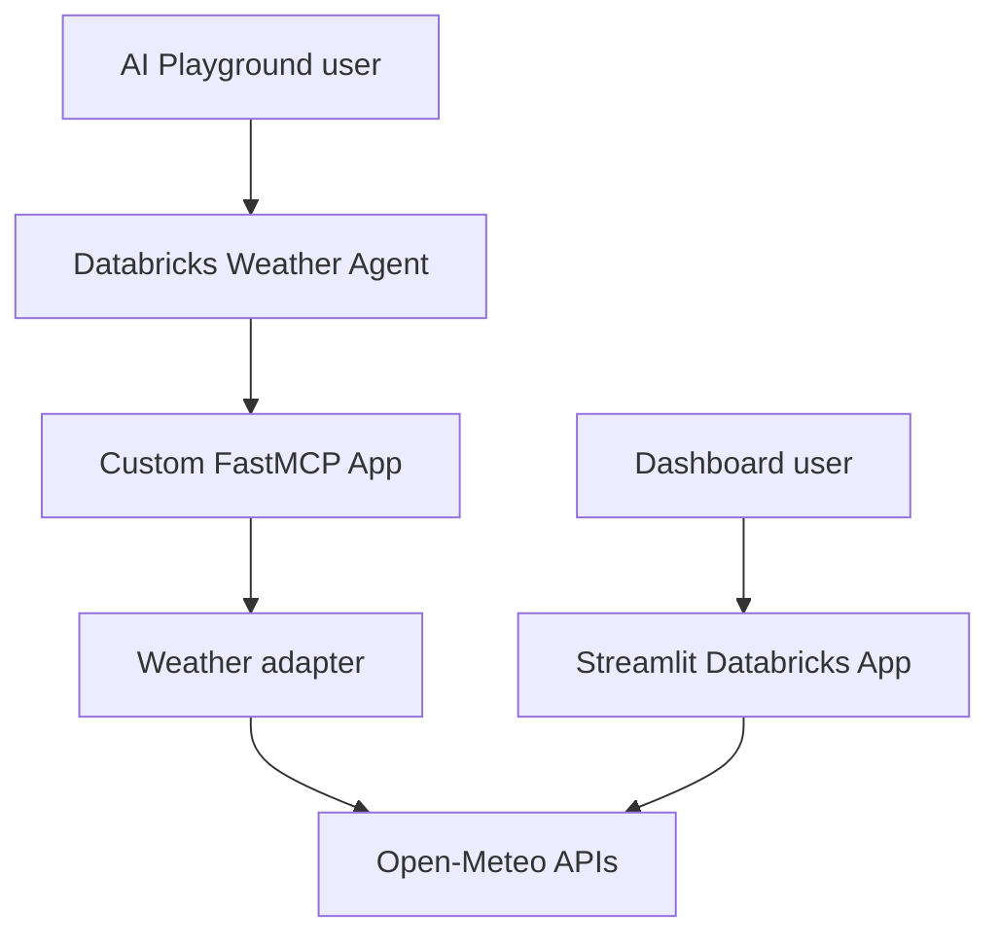

# Naza Weather Intelligence

A Databricks AI Bootcamp Day 3 capstone that demonstrates an end-to-end weather intelligence workflow with a custom MCP server, a Databricks weather agent, and a separate Streamlit dashboard.

The project turns live Open-Meteo data into three agent-ready tools for current conditions, multi-day forecasts, and explainable weather recommendations.

## Project status

The stable project consists of two independently deployed Databricks Apps:

- **`mcp-weather-server`** — a FastMCP server registered with a Databricks agent and validated in AI Playground.
- **`weather-intelligence-ui`** — a Streamlit dashboard that queries Open-Meteo directly and presents live weather, forecasts, charts, and deterministic recommendations.

The Streamlit dashboard complements the agent demonstration; it is not a chat frontend for the agent. An experimental exported agent app was intentionally excluded from this stable version.

## Architecture



This separation keeps the submitted implementation accurate:

- The **agent path** demonstrates model tool selection, MCP tool calls, grounded weather answers, and tool-failure guardrails.
- The **dashboard path** demonstrates a polished end-user interface for live weather analysis.
- Both paths use Open-Meteo, but only the agent path calls the custom MCP server.

## Day 3 capabilities

| Capability | Implementation |
|---|---|
| Custom MCP server | FastMCP over streamable HTTP |
| Agent tools | Current weather, forecast, and recommendation tools |
| External data | Open-Meteo Geocoding and Forecast APIs |
| Agent grounding | System prompt requires tool-derived weather facts |
| Explainability | Recommendation thresholds and triggered rules are returned |
| Error handling | Invalid places, dates, ranges, timeouts, and malformed responses |
| User experience | Separate Streamlit dashboard deployed as a Databricks App |
| Validation | Automated adapter tests and manual AI Playground scenarios |

## MCP tools

| Tool | Purpose |
|---|---|
| `get_current_weather(location)` | Returns temperature, apparent temperature, humidity, precipitation, wind, conditions, and observation time. |
| `get_forecast(location, days)` | Returns a normalized 1–16 day forecast with temperature, precipitation, wind, UV, and conditions. |
| `get_weather_recommendation(location, date)` | Returns forecast-backed advice and the rules that triggered it for an ISO date. |

Recommendations are deterministic:

- umbrella or waterproof layer when precipitation probability is at least 40%;
- jacket when minimum temperature is below 12 °C;
- sun protection when UV index is at least 6;
- wind caution when maximum wind is at least 40 km/h.

## Repository structure

```text
.
├── agent/
│   ├── demonstration.md
│   └── system_prompt.md
├── frontend/
│   ├── app.py
│   ├── app.yaml
│   └── requirements.txt
├── mcp_server/
│   ├── app.yaml
│   ├── requirements.txt
│   ├── weather_adapter.py
│   └── weather_mcp_server.py
├── tests/
│   └── test_weather_adapter.py
├── docs/
│   └── screenshots/
├── .gitignore
└── README.md
```

## Technology stack

- Databricks Apps
- Databricks AI Playground / Agent workflow
- FastMCP
- Streamlit
- Python
- Open-Meteo
- pandas
- pytest

## Local setup

Use Python 3.11 or later.

```bash
python -m venv .venv
source .venv/bin/activate
pip install -r mcp_server/requirements.txt
pip install pytest
pytest -q
```

Run the MCP server locally:

```bash
python mcp_server/weather_mcp_server.py
```

The streamable HTTP endpoint is available at `http://localhost:8000/mcp`.

Run the dashboard locally:

```bash
pip install -r frontend/requirements.txt
streamlit run frontend/app.py
```

## Deploy the MCP server

1. Create or update a Databricks Git Folder from this repository and branch.
2. Create a Databricks App using `mcp_server` as the source directory.
3. Deploy the App. The included `app.yaml` starts the MCP server on the Databricks App port.
4. Verify successful startup in the App logs.
5. Use `<APP_URL>/mcp` as the custom MCP endpoint.

FastMCP is mounted at the ASGI root so the Databricks proxy exposes the expected external `/mcp` route without creating `/mcp/mcp`.

## Configure the Weather Agent

1. Create a Databricks agent in AI Playground.
2. Add the deployed `<APP_URL>/mcp` endpoint as a **Custom MCP Server**.
3. Copy [`agent/system_prompt.md`](agent/system_prompt.md) into the system instructions.
4. Confirm that all three MCP tools are discovered.
5. Run the scenarios in [`agent/demonstration.md`](agent/demonstration.md).

The prompt prevents the agent from inventing live weather values, requires a tool call for weather facts, preserves returned units, and instructs the agent to surface tool errors instead of guessing.

## Deploy the dashboard

1. Create a second Databricks App named `weather-intelligence-ui`.
2. Use `frontend` as the source directory.
3. Deploy without weather API credentials; Open-Meteo does not require an API key for this educational use.
4. Validate multiple locations and forecast lengths.

The dashboard includes:

- location resolution;
- live current conditions;
- 1–7 day forecasts;
- temperature charts;
- rule-based recommendations;
- user-safe error messages;
- 15-minute data caching.

## Validation

Automated tests cover:

- normalization of current weather data;
- unknown-location handling;
- API timeout handling;
- forecast-range validation before an HTTP request.

Run them with:

```bash
pytest -q
```

Manual agent scenarios validate correct tool selection:

| Scenario | Expected tool |
|---|---|
| Current weather in Lisbon | `get_current_weather` |
| Three-day rain outlook for Chicago | `get_forecast(days=3)` |
| Umbrella or jacket advice for Austin | `get_weather_recommendation` |
| Invalid or ambiguous location | Clean tool error and no invented weather data |

## Security and reliability

- No weather API key is required or committed.
- `.env` files are ignored.
- HTTP requests use a 15-second timeout.
- External failures are converted into user-safe errors.
- Forecast dates and ranges are validated before processing.
- Weather facts remain grounded in tool output.
- Severe-weather answers direct users to official local authorities.

## Known limitations

- The Streamlit dashboard calls Open-Meteo directly; it does not invoke the Databricks agent.
- Agent evaluation is currently manual through the documented demonstration scenarios.
- The project does not provide emergency alerts or life-safety guarantees.
- Open-Meteo terms and usage limits should be reviewed before commercial use.

## Portfolio outcome

This project demonstrates practical AI Data Engineering skills across API ingestion, response normalization, agent tool design, MCP integration, deterministic business rules, Databricks App deployment, testing, and user-facing data products.

## Disclaimer

Forecasts can change. This educational project is not an emergency warning system. Consult official local weather and emergency authorities for dangerous conditions.
