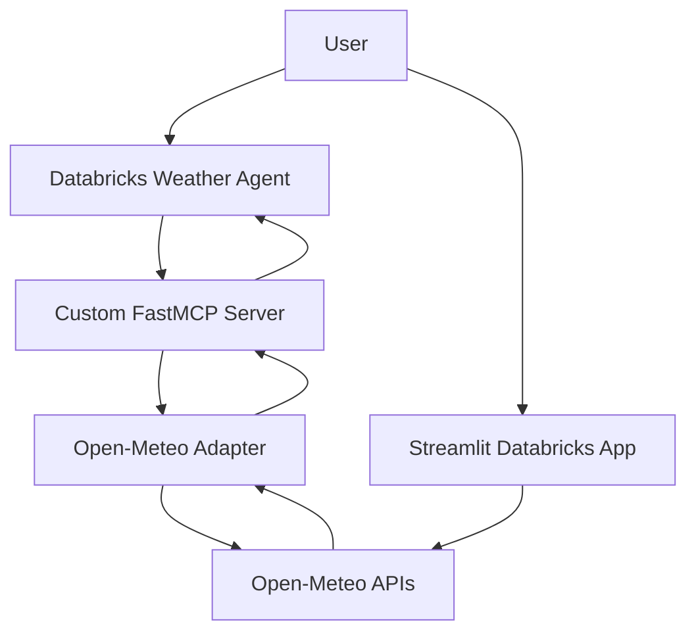

# Naza Weather Intelligence

> Databricks AI Bootcamp — Day 3: Agent Bricks and End-to-End AI Applications

Naza Weather Intelligence is an AI weather application built on Databricks. It combines a Databricks Weather Agent, live context from Open-Meteo, a custom Model Context Protocol (MCP) server, scenario-based evaluation, and a Streamlit Databricks App.

The solution demonstrates the complete Day 3 workflow: an agent selects a tool, the MCP server retrieves and normalizes external context, the agent produces a grounded response, and documented evaluation scenarios verify the behavior.

## Day 3 requirements

| Bootcamp objective | Project implementation | Evidence |
|---|---|---|
| Build an AI agent | Weather Agent configured in Databricks AI Playground / Agent Bricks | System prompt and validation scenarios in `agent/` |
| Add contextual data | Live weather context retrieved from Open-Meteo | `OpenMeteoAdapter` |
| Use agent tools | Three weather tools exposed through a custom FastMCP server | `mcp_server/weather_mcp_server.py` |
| Evaluate the application | Four repeatable scenarios test tool selection, grounding, recommendations, and error handling | `agent/demonstration.md` |
| Deploy an end-user application | Streamlit weather dashboard deployed with Databricks Apps | `frontend/` |

## Solution architecture



The project has two user experiences:

1. **Weather Agent:** uses the custom MCP server to answer natural-language questions with live weather context.
2. **Weather Intelligence UI:** presents current conditions, forecasts, charts, and explainable recommendations in a visual Databricks App.

Both experiences use the same external data source and the same recommendation thresholds. The dashboard is an independent visual application; agent validation is performed in Databricks AI Playground.

## Main components

### Weather Agent

The Weather Agent is configured in Databricks AI Playground / Agent Bricks with the instructions in [`agent/system_prompt.md`](agent/system_prompt.md). The prompt requires tool use for weather facts, preserves returned units, prevents fabricated live data, handles tool errors, and includes severe-weather guardrails.

### Custom MCP server

The FastMCP backend is deployed as the Databricks App `mcp-weather-server` and exposes a streamable HTTP endpoint at `https://<databricks-app-url>/mcp`.

| MCP tool | Description |
|---|---|
| `get_current_weather(location)` | Returns normalized current temperature, apparent temperature, humidity, precipitation, wind, conditions, and observation time. |
| `get_forecast(location, days)` | Returns a normalized 1–16 day forecast with temperature, precipitation, wind, UV index, and conditions. |
| `get_weather_recommendation(location, date)` | Returns forecast-backed advice together with the exact rules that were triggered. |

### Context layer

`mcp_server/weather_adapter.py` connects the MCP tools to Open-Meteo. It resolves locations, retrieves current and forecast data, converts WMO codes, normalizes fields and units, validates dates and ranges, and converts external failures into safe domain errors.

### Explainable recommendations

| Condition | Recommendation |
|---|---|
| Precipitation probability ≥ 40% | Bring an umbrella or waterproof layer |
| Minimum temperature < 12 °C | Bring a jacket |
| UV index ≥ 6 | Use sunscreen, sunglasses, and seek shade |
| Maximum wind speed ≥ 40 km/h | Use caution with exposed outdoor activities |

The MCP response includes both the recommendation and `triggered_rules`, making the result explainable and testable.

### Weather Intelligence UI

The Streamlit Databricks App `weather-intelligence-ui` provides location search, live current conditions, configurable 1–7 day forecasts, tables, temperature charts, date-specific recommendations, safe error messages, and 15-minute caching.

## Repository structure

```text
.
├── agent/
│   ├── demonstration.md
│   └── system_prompt.md
├── frontend/
│   ├── app.py
│   ├── app.yaml
│   └── requirements.txt
├── mcp_server/
│   ├── app.yaml
│   ├── requirements.txt
│   ├── weather_adapter.py
│   └── weather_mcp_server.py
├── tests/
│   └── test_weather_adapter.py
├── docs/
│   └── screenshots/
├── .gitignore
└── README.md
```

## Technology stack

- Databricks Apps
- Databricks AI Playground / Agent Bricks
- Model Context Protocol (MCP) and FastMCP
- Streamlit and pandas
- Python and pytest
- Open-Meteo Geocoding and Forecast APIs

## Run locally

Python 3.11 or later is recommended.

```bash
python -m venv .venv
source .venv/bin/activate
pip install -r mcp_server/requirements.txt
pip install -r frontend/requirements.txt
pip install pytest
pytest -q
```

Start the MCP server:

```bash
cd mcp_server
python weather_mcp_server.py
```

The local MCP endpoint is available at `http://localhost:8000/mcp`.

Start the dashboard from the repository root:

```bash
streamlit run frontend/app.py
```

## Deploy on Databricks

### MCP server

1. Add this repository and the `agent/weather-mcp-capstone` branch to a Databricks Git Folder.
2. Create a Databricks App named `mcp-weather-server` using `mcp_server` as its source directory.
3. Deploy the App and confirm that its status is **Running**.
4. Register `https://<app-url>/mcp` as a Custom MCP Server in Databricks AI Playground.
5. Confirm that all three tools are discovered.

### Weather Agent

1. Create or open the Weather Agent in Databricks AI Playground / Agent Bricks.
2. Attach the deployed custom MCP server.
3. Copy the instructions from [`agent/system_prompt.md`](agent/system_prompt.md).
4. Use a tool-capable model.
5. Run the evaluation scenarios in [`agent/demonstration.md`](agent/demonstration.md).

### Streamlit application

1. Create a Databricks App named `weather-intelligence-ui` using `frontend` as its source directory.
2. Deploy the App.
3. Test multiple cities and forecast lengths.

Open-Meteo does not require an API key for this educational project.

## Evaluation

The project uses repeatable behavioral evaluation scenarios:

| Test | Expected behavior |
|---|---|
| Current weather in Lisbon | Calls `get_current_weather` and returns grounded current values |
| Three-day rain outlook for Chicago | Calls `get_forecast(days=3)` and summarizes only returned data |
| Umbrella or jacket advice for Austin | Calls `get_weather_recommendation` and explains triggered rules |
| Invalid location | Returns a clean error and does not fabricate weather values |

Automated unit tests validate current-weather normalization, unknown-location handling, external API timeout handling, and forecast-range validation before any HTTP request.

```bash
pytest -q
```

## Reliability and safety

- No API keys or secrets are committed.
- External HTTP requests use a 15-second timeout.
- Tool responses use a consistent `ok/data/error` contract.
- Invalid locations, dates, and forecast ranges are handled safely.
- Live weather facts must come from MCP tool output.
- Recommendations expose the rules that produced them.
- The project does not provide emergency alerts or life-safety guarantees.

## Evidence captured

- `mcp-weather-server` deployed and running
- Three MCP tools available to the Weather Agent
- Successful AI Playground tool calls
- `weather-intelligence-ui` deployed with live weather data
- Forecast, chart, and recommendation screens
- Automated adapter tests

## Project outcome

This Day 3 project demonstrates an end-to-end AI application on Databricks, combining agents, live contextual data, MCP tools, deterministic evaluation criteria, external API integration, deployment, testing, and a user-facing data product.

## Disclaimer

Weather forecasts can change. This educational application is not an emergency warning system. For dangerous conditions, consult official local weather and emergency authorities.
